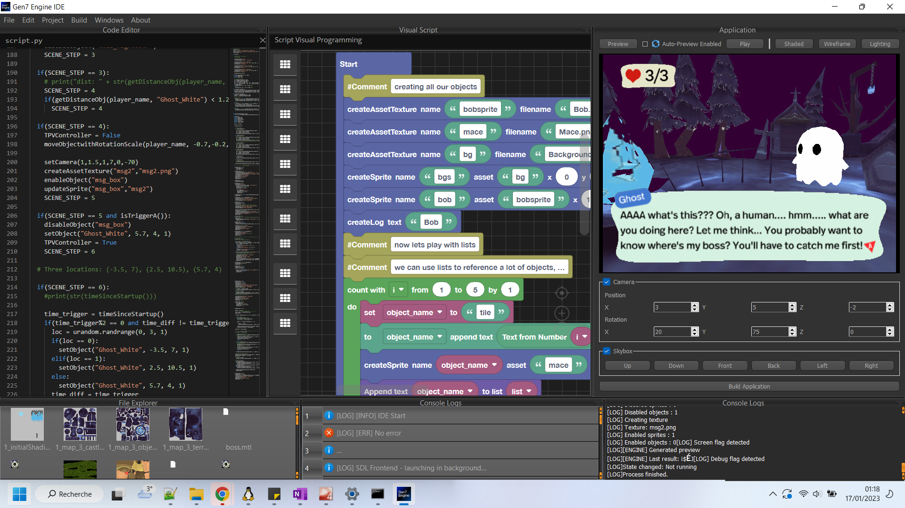
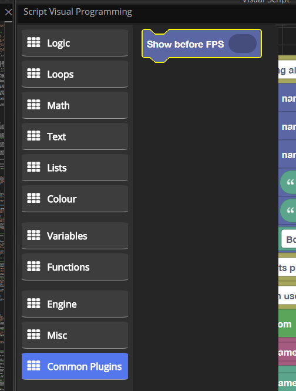

# **Gen7 Engine Plugins Repository**

### Get and create plugins to extend your engine's features!

You want to get and install plugins?  
➡️ Go to **Installation** section  
You want to create your own plugin?  
➡️ Go to **Development** section  
You want to submit your plugin to this repository?  
➡️ Go to **Contribution** section  
Any questions? Feel free to create an issue!

### Current's plugin list

| Plugin name                | Files                           | Description                                                                              | Comments |
|----------------------------|---------------------------------|------------------------------------------------------------------------------------------|------------------------------|
| Show FPS (Template)        | blocks.xml & python.py (Common) | Show FPS using createLog and timeGetFPS (can be used as a template's plugin)             |                              |
| Blender Collision Exporter | blender_boxcolliders.py         | Exports Blender's current scene cubes in a specific collection to a Gen7 collision boxes | Blender Py plugin (not Gen7) |

## Contribution

You're welcome to contribute with your developed plugins and add them to this repo through pull requests.  Don't hesitate to ask any questions about the procedure in the pull's comments.  
All the plugins will be tested analysed and approved before merge. And if your plugin is awesome, we will contact you to integrate it directly in Gen7's default installation (with your proper agreement and credits of course)!

## Installation

This repository contains plugins that are ready to use in Gen7 Engine.  
To install them, please follow these instructions:

1. Download this repository, extract the ZIP archive and copy the plugins folder content to your <your IDE location>\editor\plugins folder

2. Open Gen7 Engine IDE

3. Find your ready to use installed plugins in the toolbox (here Show FPS)

## Development

*Derived from http://www.gen7.idpowered.com/forums/ips/index.php?/gen7-engine-documentation/advanced-creating-your-own-plugins-r11/*

You can create your own plugins to create new behaviors, ease development and implement specific systems such as collision or physics.
These plugins can be redistributed at your ease to extend Gen7 Engine.
 
